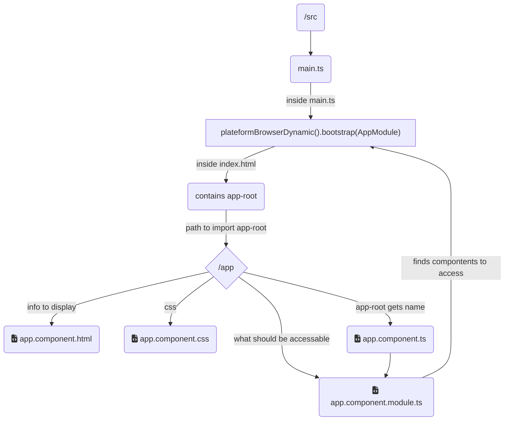
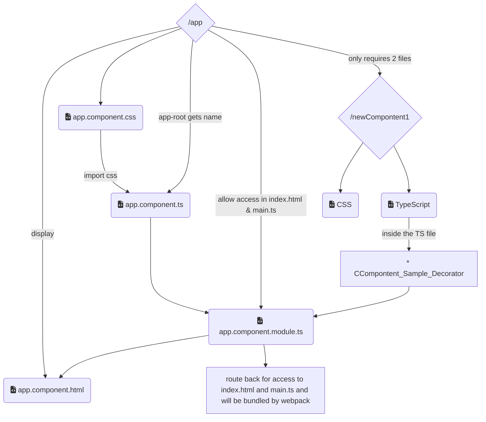

# Welcome!

Learning Angular from [Udemy.](https://www.udemy.com/course/the-complete-guide-to-angular-2/learn/lecture/6655598#overview)

## Table of Contents

1. [My first application](./my-first-app/README.md)

## Using Angular

Uses Typescript. 

### Setting up new project

`ng new new-project-name`

Optional, include `--no-strict`

You will be asked if you want to include routing and which style sheet format you want to use.

Set up to use [bootstrap](https://getbootstrap.com/docs/5.3/getting-started/introduction/)

### Bring up a Server

`ng serve`, creates a working server where we can test information.

Default port will be provided when created, usually 4200.

### Navigating Application

The display for all content ends at the src/index.html. Content that is generated is provided inside of the body of that doc.

The content that is generated though src/app/app.component.html.

To provide more dynamic fields information should be provided to src/app/app.component.ts.

If you want to include additional Angular modules they will need to be imported and provided inside src/app/app.module.ts

From front the back main.ts if the first code that runs. `AppModule` is what started off the process. This content will be cross referenced within the app.module.ts. We have to know this content exists at inception.



### Components

A component refers to modular code that will resolve themselves into a whole webpage related to a singular DOM. Example: A nav bar would be one component, while your footer would be another, a the main body a mix of several different components added together.

The backbone of angular is components.

You start with the "app" component which is the "root" of all components. Other children components will be nested inside of your root.

Application related contents, such a new components usually live inside of the [app folder](`./my-first-app/src/app`) folder.

Each component should have it's own folder and best practice states that folder should be titled after the component it contains.

The naming convention usually goes: `title.component.ts`, this will aslo be the name of the component.

We use classes to create these components which are known as *Decorators*. We have to import the component type to help differentiate between a regular typescript class and an angular component class. The class use is really what make it possible to reuse these elements.

You usually will have your `ts` file and the related `html` file that will house the template `html` code.

In order to have access to the components, make sure the are "registered" within the [module file](`./my-first-app/src/app/app.module.ts`)

#### Requirements

All components is they must have a `selector` and `template`. 

##### Selectors

You have multiple options when it comes to selectors. When you provide a straight string to the option it will be considered a html tag.

If it is inside [] it will be an attribute.

If you add a . to the front of the string, it will be a class element.

It is important to note that you will need to update your html file accordingly to it will display correctly.

Use the html tag, add the component as an attribute inside another tag or include the class name inside the class attribute.

While the selector can be an attribute, the attribute cannot be assigned to another component.

##### Templates

Either a `templateUrl` or `template`. Template will allow you to write inline html elements. Use backticks to allow for js functionality.

#### CLI Component Creation

`ng generate component newComponentName`

There is also a shorthand.

`ng g c newComponentName`

This will create a folder inside of [app](./my-first-app/src/app/) with the provided new component name and a css, html, ts and spec.ts files.

spec.ts is used for testing. It is not a required file.

This should also auto add your file to the [module](./my-first-app/src/app/app.module.ts), but make sure you verify the registration.

#### Decorators

You can identify a decorator in code since it will have an `@` before the element.

You will have to configure these items by providing a JS object with the required information.

### Example



##### Compontent_Sample_Decorator

```Angular
@Component {[
        selector: 'app-new-compontent1
        templateUrl:./path/to/html or template:<selector></selector>
        may also include styleUrl: ['./css/path']
        
        export class ComponentName implements OnInit {
            constructor() {}
                ngOnInit() {
        }
    }'
]}
```

### Databinding

Communication between typescript components/business logic and the template.

The only requirements for "string interpolation" is that it can resolve itself into a string. You cannot provide multiline logic.

### Property Binding
